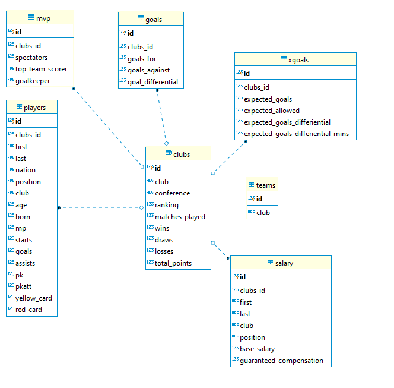

                                                                  

## Local Data ETL
                                                                        
### Thought Process
                                                            
* Create a `mls_db` database in dbeaver/postgres then create the following two tables within:

  * A "2019 Major League Soccer" table that contains the columns `Ranking', 'Squad', 'Club', 'Matches Played', 'Wins', 'Draws', 'Losses', and 'Total Points'.

  * A "2019 Average Club Salary" table that contains the columns 'Club',  'Total Salaries', 'Total Expected Salaries', 'Average Salaries', and 'Average Expected Salaries'.
                                                             
  * Be sure to assign a primary key, as Pandas will not be able to do so. In our case it will be by 'Club'. 

* In Jupyter Notebook perform all ETL.

* **Extraction**

  * Webscraping into a pandas DataFrame:
  * https://mlsplayers.org/resources/salary-guide - Player Salaries 2019
  * https://fbref.com/en/comps/22/2798/2019-Major-League-Soccer-Stats Team Stats 2019           "Simple Parent/Child Relationship"

  

* **Transform**

  * Copy only the columns needed into a new DataFrame.

  * Rename columns to fit the tables created in the database.

  * Handle any duplicates. **HINT:** In players salary, players have different names but teams are unique.

  * Set index to the previously created primary key, which will be ['Club'].

* **Load**                                                                                               

  * Create a connection to database.

  * Check for a successful connection to the database and confirm that the tables have been created.

  * Append DataFrames to tables. Be sure to use the index set earlier.

* Confirm successful **Load** by querying database.

    * Combine the two tables "Eastern" and "Western" . 
    * Join the two tables select:
    * The `Ranking', 'Squad', 'Club', 'Matches Played', 'Wins', 'Draws', 'Losses', and 'Total Points' from the "2019 Major League Soccer Stats" table. 
    * The 'Club',  'Total Salaries', 'Total Expected Salaries', 'Average Salaries', and 'Average Expected Salaries' from the "2019 Average Club Salary" table. 
    * 'Club' will be the joining point. 
    
 
